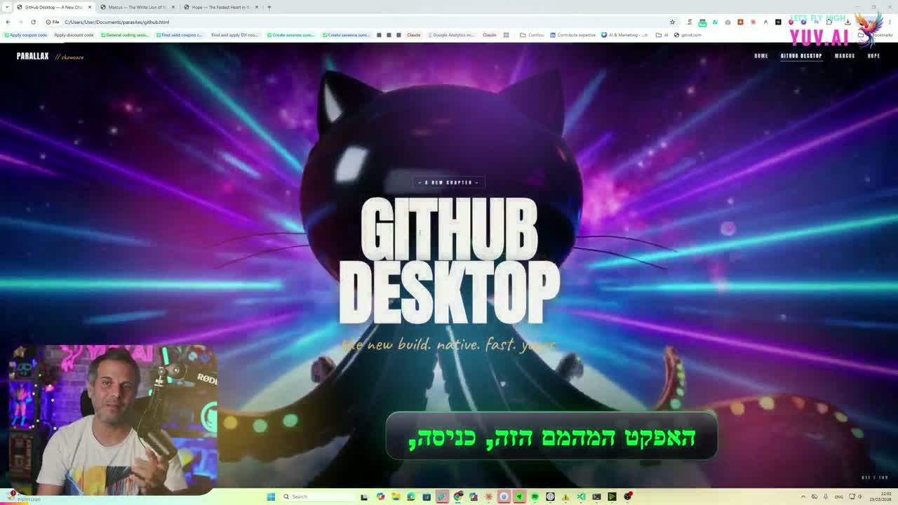
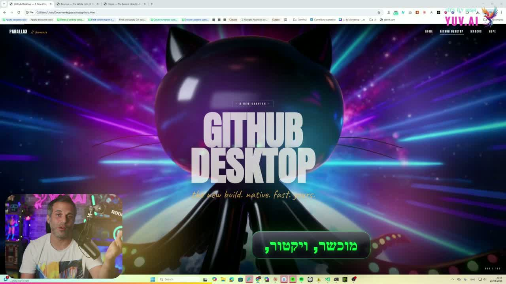
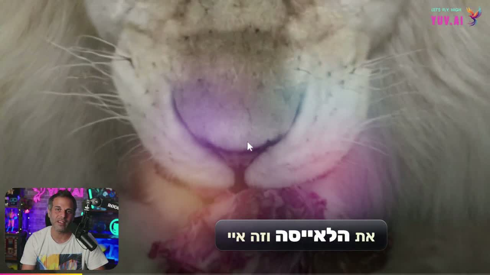
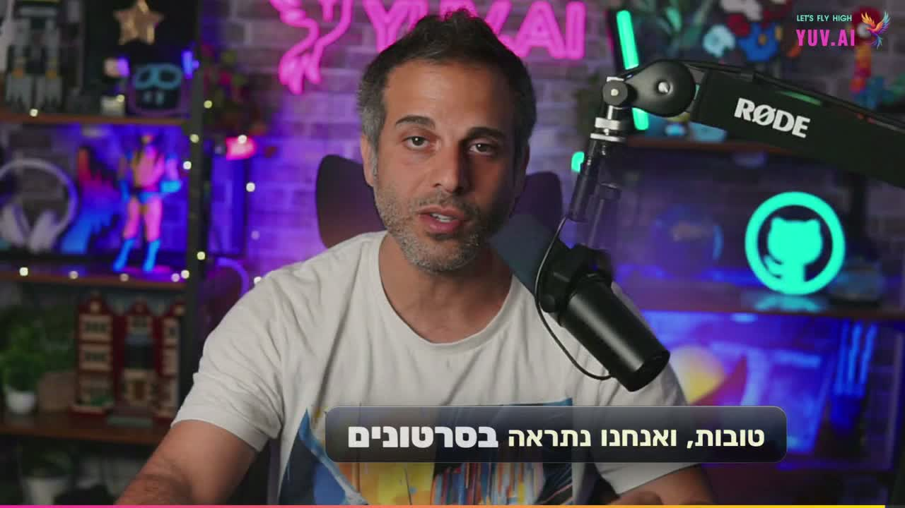
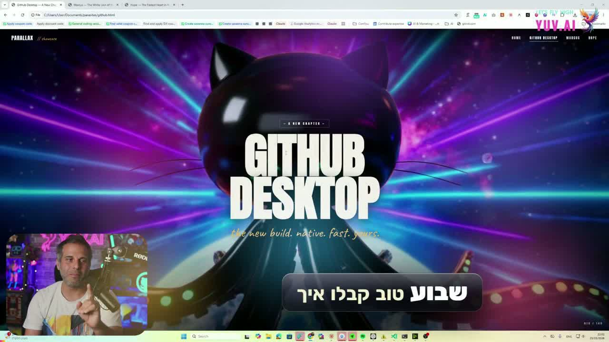
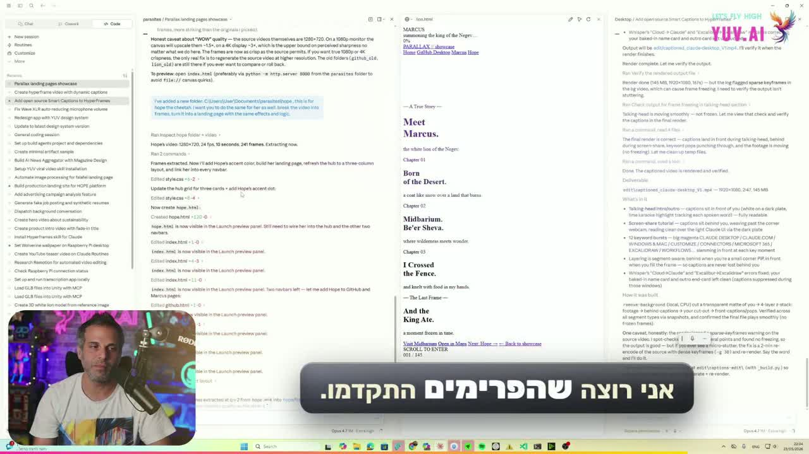

<div align="center">

# 🎬 video-edit

### An agent skill + interactive webapp that turn any video into a captioned cinematic showcase — with a human-in-the-loop transcript review the agent waits for automatically.

<p>
  
  
  
  
</p>

<table>
<tr>
<td></td>
<td></td>
</tr>
<tr>
<td></td>
<td></td>
</tr>
</table>

</div>

---

## Why this exists

Whisper hears `Claude` as `cloud`, `Excalidraw` as `Excalibro`, and Hebrew "האריה הלבן" as
"הרגע הלבן." Most "AI video editors" silently bake those mistakes into a 12-minute render
you can't undo without re-rendering. We do the opposite — the agent **stops mid-pipeline**,
hands you an interactive transcript editor, and only continues when you click **Approve &
Render**. The captions are perfect because *you* approved them — and the agent knows you
approved them because the webapp posts the signal back over a local socket.

That single design choice — **a webapp that signals an agent over HTTP, not a chat message** —
is what makes this feel different from anything else in the open-source space.

---

## What it does

| Step | Who | What |
| ---- | --- | ---- |
| 1 | **Agent** | Probes the source video (`ffprobe`), scaffolds a HyperFrames project, extracts audio. |
| 2 | **Agent** | Transcribes with `faster-whisper large-v3` (CPU-int8 fallback baked in for Windows / CUDA-less machines). |
| 3 | **Agent** | Applies a curated **`corrections.json`** dictionary — known Hebrew & product-name mishears get fixed automatically. |
| 4 | 🛑 **Agent → You** | Spawns a local HTTP review server. Prints a clickable URL: `http://localhost:<port>/`. |
| 5 | **You** | Open the URL. The editor auto-loads the transcript + video. Edit inline (RTL aware, video synced, autosaving). Optionally enable in-browser **WebLLM** to get AI-suggested fixes per segment (Qwen 2.5-3B / Llama-3.2-3B over WebGPU). |
| 6 | **You** | Click **`✓ APPROVE & RENDER`**. |
| 7 | **Agent** | Server writes `transcript_review.txt` to the project and exits 0 → the agent's background task fires automatically. |
| 8 | **Agent** | Redistributes word timings, regenerates the caption sub-composition (liquid-glass pills, alternating editorial + matrix styles), optionally runs background-removal for behind-subject text, and renders the final MP4. |

No `continue` typed. No file moved. No npm scripts run. The user clicks one button.

---

## The captions are not subtitles

Renders include the full HyperFrames caption library — selectable per project, soon
selectable **per segment** (see [Roadmap](#roadmap)):

- **Editorial Emphasis** — dual-font (sans body + italic serif emphasis word) on a frosted glass pill.
- **Matrix Decode** — letters scramble for ~180 ms then resolve, in Matrix green with a soft glow.
- **Kinetic Slam** — full-screen single-word slams with alternating entrance directions.
- **Parallax Layers** — the killer one. Massive red display text that *passes behind* the
  subject. We background-remove the talking-head clip, drop the text on `z-index: 1`, put the
  alpha-masked subject on `z-index: 2` — text weaves around their head.

Plus a **liquid blob background** (drifting magenta / cyan / gold orbs, screen-blended so
they glow on dark talking-heads and vanish on white app UI), **liquid morph transitions** at
section cuts, **camera punch-ins** synced to caption beats, and **subtle film grain +
vignette** during cinematic segments.

<table>
<tr>
<td><br/><sub>Liquid blob background — glows on dark, invisible over white</sub></td>
<td><br/><sub>Liquid-glass pill caption over the talking-head outro</sub></td>
</tr>
</table>

---

## Quick start

### One-shot install (Mac/Linux)

```bash
curl -sSL https://raw.githubusercontent.com/hoodini/ai-agents-skills/master/install.sh | bash
```

Installs `node ≥ 22`, `python ≥ 3.10`, `ffmpeg`, `faster-whisper`, `hyperframes` CLI, and
drops this skill into `~/.claude/skills/video-edit/`. Idempotent — safe to re-run.

### Manual (Windows or anywhere)

```powershell
winget install OpenJS.NodeJS.LTS
winget install Python.Python.3.12
winget install Gyan.FFmpeg
pip install faster-whisper
npm install -g hyperframes
git clone https://github.com/hoodini/ai-agents-skills "$HOME/.claude/skills-src"
robocopy "$HOME/.claude/skills-src/skills/video-edit" "$HOME/.claude/skills/video-edit" /E
```

### Use it from your AI agent

Open Claude Code (or Cursor / Codex / Copilot — anything that supports the agent-skills
standard). Drop a path and say it like a human:

```
edit this video: C:\Users\me\Videos\demo.mp4
```

…or with Hebrew / mixed-language:

```
ערוך לי את הסרטון הזה עם כתוביות: ~/Videos/talk.mp4
```

The agent matches `video-edit` by description, runs the pipeline, and stops to ask you to
approve the transcript. That's it.

---

## The editor

Open it directly without an agent at all:

```bash
# Static (any browser):
open ~/.claude/skills/video-edit/transcript-editor/index.html

# Or run it as a tiny review server (Approve & Render flow):
python ~/.claude/skills/video-edit/references/serve_review.py /path/to/hyperframes-project
```

### Features

- **One-click project folder load** — File System Access API auto-finds `transcript.json`
  and the source/footage video; saves write `transcript_review.txt` straight back in place.
- **Recent projects history** — every project you've touched is in a card grid on the
  upload screen. One click to reopen, hover to download the last review file or delete.
- **Drag-and-drop a folder** anywhere on the upload screen.
- **Server mode (Approve & Render)** — when launched via `serve_review.py`, the editor
  auto-opens with the project loaded and the Save button becomes `✓ APPROVE & RENDER`.
  Clicking it posts the transcript back, writes the file, and exits the server — the
  parent agent sees the task complete and runs the render automatically.
- **Per-segment inline editing** — `direction: auto` per textarea, so Hebrew and English
  segments render in the right direction without configuration.
- **Click-to-seek** — clicking a segment seeks the video; the active segment auto-scrolls
  into view as the video plays.
- **Dictionary apply** — paste `{"wrong": "right", ...}` JSON, get whole-word substitution
  across every segment with one click. Unicode word boundaries (works for Hebrew).
- **Find / replace** — substring across all segments.
- **WebLLM AI suggestions (optional)** — toggle on, ~1.5 GB model downloads into your
  browser cache, each segment gets a 🤖 button that asks the local model to fix Whisper
  mishears given previous/next-line context. Accept or dismiss inline. Runs entirely on
  your machine via WebGPU. No API key. No data leaves the browser.
- **Autosave to `localStorage`** — refresh-safe.
- **`beforeunload` guard** — browser warns before navigating away with unsaved edits.
- **Keyboard shortcuts** — Space (play/pause), Ctrl/⌘ S (save), Ctrl/⌘ O (open another
  project), Ctrl/⌘ F (find), Esc (close modal), `?` (help).

### What the editor isn't doing

- Sending anything to an external server.
- Uploading your video or transcript.
- Phoning home.
- Logging telemetry.

It's a single HTML file. Inspect it.

---

## Architecture

```
┌─────────────────────────────────────────────────────────────────────────┐
│ YOUR AGENT (Claude Code / Cursor / Codex / Copilot)                     │
│                                                                         │
│   "edit this video: <path>"                                             │
│        │                                                                │
│        ▼                                                                │
│   reads SKILL.md, runs:                                                 │
│     ffprobe → ffmpeg (audio) → faster-whisper → corrections.json        │
│     ↓                                                                   │
│   spawns serve_review.py as a BACKGROUND TASK                           │
│        │                                                                │
│        │ blocks on threading.Event                                      │
└────────│────────────────────────────────────────────────────────────────┘
         │ prints REVIEW_URL=http://localhost:<port>
         ▼
┌─────────────────────────────────────────────────────────────────────────┐
│ LOCAL HTTP SERVER (Python stdlib, no deps)                              │
│                                                                         │
│   GET  /api/project    → { transcript, videoUrl, projectName }          │
│   GET  /video          → streamed source video (HTTP Range)             │
│   GET  /api/recents    → ~/.hyperframes-editor/projects.json            │
│   POST /approve        → writes transcript_review.txt, sets Event       │
└─────────────────────────────────────────────────────────────────────────┘
         ▲
         │ fetch /api/project on load, POST /approve on click
         │
┌─────────────────────────────────────────────────────────────────────────┐
│ TRANSCRIPT EDITOR (static HTML, runs in your browser)                   │
│                                                                         │
│   • Loads transcript + video automatically                              │
│   • You edit segments inline (RTL aware, video synced)                  │
│   • Optional: enable WebLLM (Qwen 2.5-3B) for AI suggestions            │
│   • Click "✓ APPROVE & RENDER"                                          │
└─────────────────────────────────────────────────────────────────────────┘
         │ approval POST returns 200, server thread exits 0
         ▼
┌─────────────────────────────────────────────────────────────────────────┐
│ AGENT RESUMES (background-task notification fires)                      │
│                                                                         │
│   apply_review.py → gen_body.py → npx hyperframes render                │
│   ↓                                                                     │
│   Final MP4                                                             │
└─────────────────────────────────────────────────────────────────────────┘
```

The handshake is **a thread-blocked HTTP POST**, not a chat message. That's what makes the
flow automatic.

---

## What's in this folder

```
skills/video-edit/
├── SKILL.md                      ← agent-readable workflow (the recipe)
├── README.md                     ← you are here
├── references/
│   ├── setup.md                  ← install commands for every OS
│   ├── transcribe.py             ← faster-whisper, CPU-int8 fallback
│   ├── make_review.py            ← apply corrections + emit transcript_review.txt
│   ├── apply_review.py           ← ingest edits, redistribute word timings
│   ├── serve_review.py           ← the local HTTP review server (Approve & Render)
│   ├── gen_body.py               ← liquid-glass caption-body generator
│   ├── host-template.html        ← HyperFrames host composition (full layered render)
│   ├── liquid-blobs.html         ← drifting blob background sub-composition
│   ├── caption-parallax-outro-en.html
│   ├── caption-parallax-outro-he.html
│   ├── corrections-hebrew.md     ← curated Hebrew Whisper mishears
│   └── transcript-review-workflow.md
├── transcript-editor/
│   ├── index.html                ← the webapp — open in any modern browser
│   └── README.md
└── screenshots/                  ← static stills used in this README
```

---

## Examples

This skill has produced:

- A 13-second Avatar-style brand reel with 5 different caption styles (Kinetic Slam →
  Editorial Emphasis → Parallax Layers → Matrix Decode → Kinetic Slam CTA) showcasing each
  HyperFrames caption style. Background-removed subject, behind-text effect, viewfinder HUD.
- A 2-minute-47-second tutorial featuring talking-head intro, screen-recording body, talking-head
  outro, and an animated end card. Captions in liquid-glass pills shifted left to clear a
  bottom-right webcam PiP, with behind-subject text on both the intro and outro talking-heads.
- A 2-minute-59-second Hebrew showcase with full RTL captions, Rubik typography, behind-subject
  "שבוע טוב / נתראה / תגיבו" Hebrew text on the outro talking-head, and Whisper-mishear
  corrections (e.g. `קלוט → קלוד`, `המאמם → המהמם`, `אישות → שוט`).

All three were rendered end-to-end from the same agent skill with no manual scripting.

---

## Roadmap

- [ ] **Per-segment caption-style picker** — in the editor, click a segment's style chip,
  pick from the 15 HyperFrames caption styles, see a live preview video. Save sidecars
  `caption_styles.json`. Renderer concatenates per-style sub-compositions on one track.
- [ ] **Style-preview grid** — modal showing autoplaying `.mp4` previews for all 15 styles
  pulled from `static.heygen.ai`.
- [ ] **Multi-language Whisper corrections** — auto-load `corrections-<lang>.json` based on
  detected language.
- [ ] **Hosted demo** — deploy the editor as a public static URL (Vercel) so anyone can try
  it without installing.
- [ ] **Background-removal preview** — show the alpha-cutout in the editor so you know
  which segments will use parallax-behind treatment.

---

## Contributing

This is open source and built for the AI-agent community.

**Best first PRs:**

- Add a Hebrew correction we missed to `references/corrections-hebrew.md`.
- Port the corrections approach to another language (`corrections-es.md`, etc.).
- Add a new HyperFrames caption-style adapter to `gen_body.py` (it's a small switch
  statement — see the existing editorial/matrix cases as a pattern).
- Take a polished screenshot of the editor in action and drop it into `screenshots/`.
- Document a render gotcha you hit.

PRs land on `master` directly — small repo, fast turnaround.

---

## Credits

Built by [Yuval Avidani](https://github.com/hoodini) and Claude Sonnet 4.7 during the
development of the *Practical Claude Desktop* course. Stands on the shoulders of:

- **[HeyGen HyperFrames](https://github.com/heygen-com/hyperframes)** — the HTML-to-video
  rendering engine that makes all the caption animations possible.
- **[faster-whisper](https://github.com/SYSTRAN/faster-whisper)** — CTranslate2-based
  Whisper inference. Hebrew accuracy with `large-v3` on CPU is genuinely impressive.
- **[WebLLM](https://github.com/mlc-ai/web-llm)** — in-browser LLM inference via WebGPU.
  Qwen 2.5-3B running on your laptop fixing Hebrew Whisper output offline is still magic.

---

<div align="center">

**[← All skills](../../README.md)**  ·  **[Open editor in browser →](transcript-editor/)**

</div>
